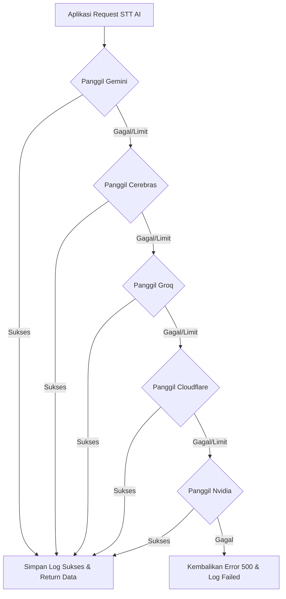
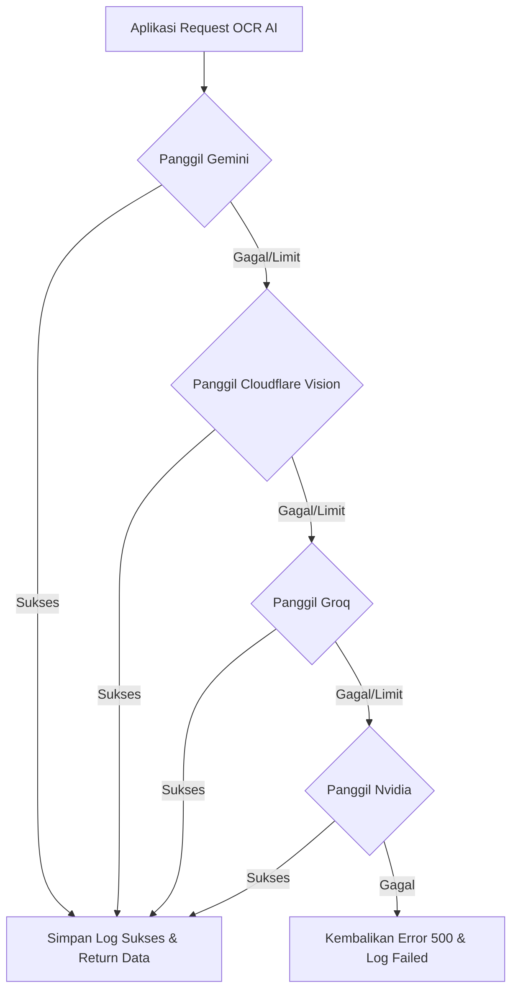

# 🐷 Danaku App & Cloud Server (Admin Console)

**Danaku** adalah sistem asisten pencatat keuangan pribadi terintegrasi berbasis Mobile (Flutter) dan Awan (Laravel) yang dirancang untuk memudahkan pencatatan transaksi harian secara cerdas menggunakan kecerdasan buatan (Speech-to-Text & Vision OCR).

---

## 🌟 Fitur Utama

### 📱 Aplikasi Mobile (Flutter)
1.  **Speech-to-Text AI (STT)**: Cukup rekam suara Anda (misal: *"beli bensin dua puluh ribu rupiah"*), AI akan otomatis mengurai nominal, kategori, dan keterangan transaksi.
2.  **Vision OCR Struk**: Ambil foto struk belanja Anda, sistem akan memindai item belanjaan beserta total pengeluaran secara instan.
3.  **Keamanan PIN & Akses Lokal**: Mengamankan data finansial sensitif Anda menggunakan enkripsi lokal dan PIN 4-digit.
4.  **Sinkronisasi Awan & Offline Mode**: Aplikasi tetap berjalan penuh saat offline menggunakan SQLite lokal, dan akan otomatis mencadangkan data ke awan saat mendeteksi koneksi internet kembali aktif.

### 🌐 Konsol Web Admin (Laravel)
1.  **Dashboard Finansial Global**: Memantau grafik statistik pengeluaran kategori paling boros dan wallet teraktif secara agregat.
2.  **Monitoring Token AI Lanjutan**:
    *   Sisa kuota harian otomatis untuk **Google Gemini**, **Cerebras Gemma**, **Groq Qwen**, **Cloudflare Llama**, dan **Nvidia Llama**.
    *   Waktu respons respons (Latency dalam *milliseconds*) menggunakan grafik grafik garis interaktif (Chart.js).
    *   Persentase kehandalan tingkat kesuksesan vs kegagalan panggilan API.
3.  **Kelola Pengguna**: Meninjau status pencadangan data, ukuran database backup di awan, serta fitur hapus akun pengguna yang diamankan dengan modal SweetAlert 2 yang cantik.

---

## 🗂️ Dokumentasi Akun Akses

### 1. Panel Administrator (Web Portal)
*   **URL Akses**: `https://api-danaku.sir-l.web.id/login`
*   **Email**: `admin@danaku.id`
*   **Password**: `admin123`
*   **Peran**: Mengelola seluruh cadangan data pengguna dan memantau status token AI.

### 2. Akun Pengguna Uji Coba (Mobile App / Backend Seeder)
*   **Email**: `mada@email.com`
*   **Password**: `password` (Password default Laravel Seeder)
*   **Keterangan**: Berisi data dummy simulasi sebanyak 10.000 data transaksi acak untuk kebutuhan pengujian laporan grafis.

---

## 🛠️ Panduan Instalasi & Deploy

### A. Deploy Backend & Web Admin di Server VPS (Ubuntu + Nginx)

1.  **Clone Repositori**:
    ```bash
    cd /var/www
    git clone https://github.com/itzluthfi/KEUANGANKU.git danaku-server
    ```
2.  **Konfigurasi Environment (`.env`)**:
    Salin file `.env.example` ke `.env` di dalam folder `DanakuLaravel` dan konfigurasikan database serta API Key AI:
    ```env
    APP_URL=https://api-danaku.sir-l.web.id
    DB_DATABASE=danaku
    DB_USERNAME=root
    DB_PASSWORD=yourpassword
    
    # Kunci API Kecerdasan Buatan (AI)
    GEMINI_API_KEY=your_gemini_key
    GROQ_API_KEY=your_groq_key
    NVIDIA_API_KEY=your_nvidia_key
    CLOUDFLARE_ACCOUNT_ID=your_cloudflare_account_id
    CLOUDFLARE_API_TOKEN=your_cloudflare_api_token
    CEREBRAS_API_KEY=your_cerebras_key
    ```
3.  **Instalasi Dependensi & Set Hak Akses**:
    ```bash
    composer install --no-dev --optimize-autoloader
    chown -R www-data:www-data storage bootstrap/cache
    chmod -R 775 storage bootstrap/cache
    ```
4.  **Jalankan Migrasi & Seeder Akun**:
    ```bash
    php artisan migrate --force
    php artisan db:seed --class=AdminSeeder
    ```
5.  **Bersihkan Cache**:
    ```bash
    php artisan config:clear
    php artisan route:clear
    php artisan view:clear
    ```

---

### B. Kompilasi & Konfigurasi Aplikasi Mobile (Flutter)

1.  **Sesuaikan URL Server**:
    Buka file `DanakuApp/lib/services/sync_service.dart` dan pastikan URL sudah mengarah ke server hosting VPS Anda:
    ```dart
    final String laravelBaseUrl = "https://api-danaku.sir-l.web.id/api";
    ```
2.  **Instalasi Library & Build APK Rilis**:
    Jalankan perintah berikut di terminal komputer lokal Anda:
    ```bash
    flutter pub get
    flutter build apk --release
    ```
3.  **Lokasi Berkas Output**:
    Berkas installer APK siap pakai untuk HP Android berada di path:
    `DanakuApp/build/app/outputs/flutter-apk/app-release.apk`

4.  **Menjalankan di Web dengan Menonaktifkan Keamanan Web (CORS Bypass untuk Pengujian)**:
    Jika Anda menguji aplikasi di web browser (Chrome) dan mengalami pemblokiran CORS saat memanggil API backend di server VPS secara langsung, jalankan perintah berikut untuk menonaktifkan keamanan web (Chrome security sandbox) saat debugging:
    ```bash
    flutter run -d chrome --web-browser-flag "--disable-web-security" --web-browser-flag "--user-data-dir=C:\tmp\chrome_dev"
    ```

---

## 📈 Alur Kerja Sistem Fallback AI & Logs

Ketika pengguna melakukan input suara (Speech-to-Text) atau pemindaian struk belanja (OCR):

### 1. Rantai Fallback Parser Suara / Teks (STT)


### 2. Rantai Fallback Parser Struk Belanja (OCR)


Setiap keberhasilan dan kegagalan proses di atas akan dihitung kecepatannya (latency) dan dicatat ke dalam database untuk divisualisasikan pada menu **Monitoring Token AI** di panel administrator.
